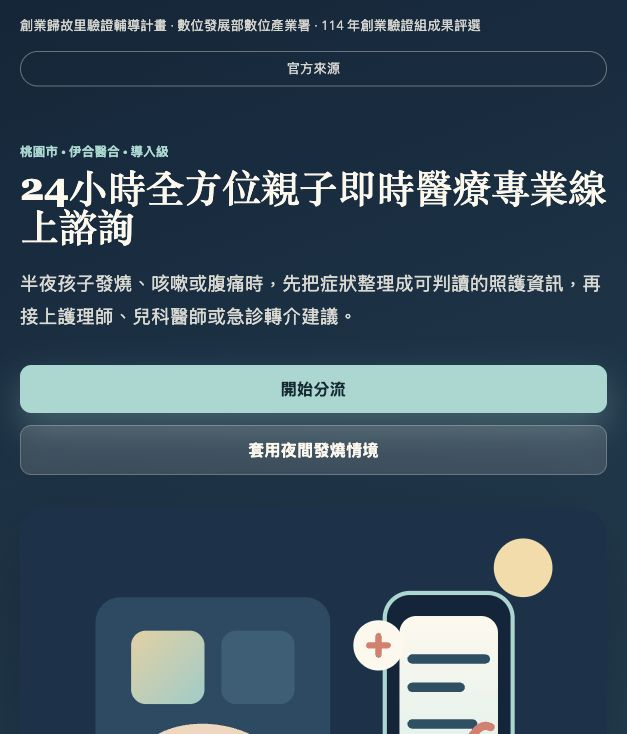
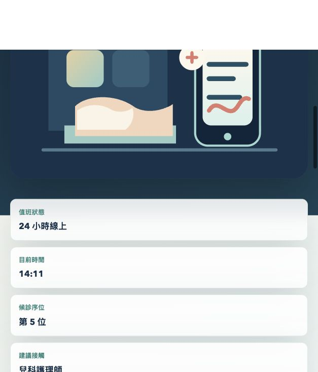

# 24小時全方位親子即時醫療專業線上諮詢 Demo

## 快速看懂

- 線上 Demo：https://atlasforcn.github.io/startup-parent-medical-consult/
- 這個原型在做什麼：把親子即時醫療諮詢做成夜間兒科分流與線上諮詢平台。
- 特色定位：特色是用症狀、年齡、警示徵象形成分流，再接上候診、提醒與轉診建議。
- 操作流程：輸入孩子症狀、年齡與風險因子 → 取得護理師/醫師候診與分流建議 → 產生照護提醒，必要時提示轉診或急診

展開完整功能流程截圖

這是一個以「夜間兒科急診前的家庭照護與即時線上諮詢」為情境的原生 HTML/CSS/JavaScript 互動 demo。使用者可輸入孩子症狀與風險因子，系統會模擬分流、安排 24 小時醫師或護理師候診、產生線上諮詢事件、建立用藥與照護提醒，並在高風險情境下提出升級或轉診建議。

## 比賽來源

- 計畫名稱：創業歸故里驗證輔導計畫
- 指導/來源機關：數位發展部數位產業署
- 官方來源：[114創業歸故里驗證輔導計畫｜晉級與得獎名單](https://sccontest.tca.org.tw/content/display#sectionA)
- 來源頁面公告：`114創業歸故里+驗證輔導計畫` 創業驗證組成果評選分級獎勵名單

## 屆次/階段

- 年度：114 年
- 組別/階段：創業驗證組成果評選分級獎勵名單
- 驗證縣市：桃園市
- 公司/團隊：伊合醫合
- 作品名稱：24小時全方位親子即時醫療專業線上諮詢
- 級別：導入級

## 核心概念

此 demo 將「家長半夜不確定是否該急診」的焦慮場景，轉化為一個分層支援流程：

1. 先用症狀、年齡、體溫與警示徵象做初步分流。
2. 依風險安排護理師、兒科醫師或急診轉介。
3. 將每一次線上諮詢動作記錄成事件，讓照護脈絡清楚。
4. 產生用藥、補水、觀察與回診提醒。
5. 在症狀惡化或出現警訊時，清楚提示升級與轉診建議。

## Demo 範圍

本 demo 是產品概念驗證介面，不連接真實醫療資料庫、醫師排班系統、視訊服務或藥物資料庫。畫面與分流邏輯皆為互動展示用途，不能取代專業醫療診斷、急救判斷或醫囑。這是依公開得獎資訊與概念自行製作的興趣原型，不是原團隊官方 demo 或產品，也不代表原團隊或主辦單位立場。

### 互動功能

- 親子症狀分流：選擇症狀、年齡、體溫與警示徵象後產生風險等級。
- 24 小時候診：依分流結果調整醫師/護理師候診安排與等待時間。
- 線上諮詢事件：可模擬接通、補充照片、完成諮詢等事件。
- 用藥/照護提醒：依症狀生成照護提醒，並可標記完成或延後。
- 風險升級/轉診建議：高風險或警示徵象會觸發急診或轉診建議。

## 使用方式

直接以瀏覽器開啟 `index.html` 即可使用，不需要安裝套件或啟動建置工具。
